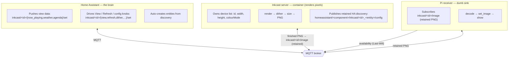
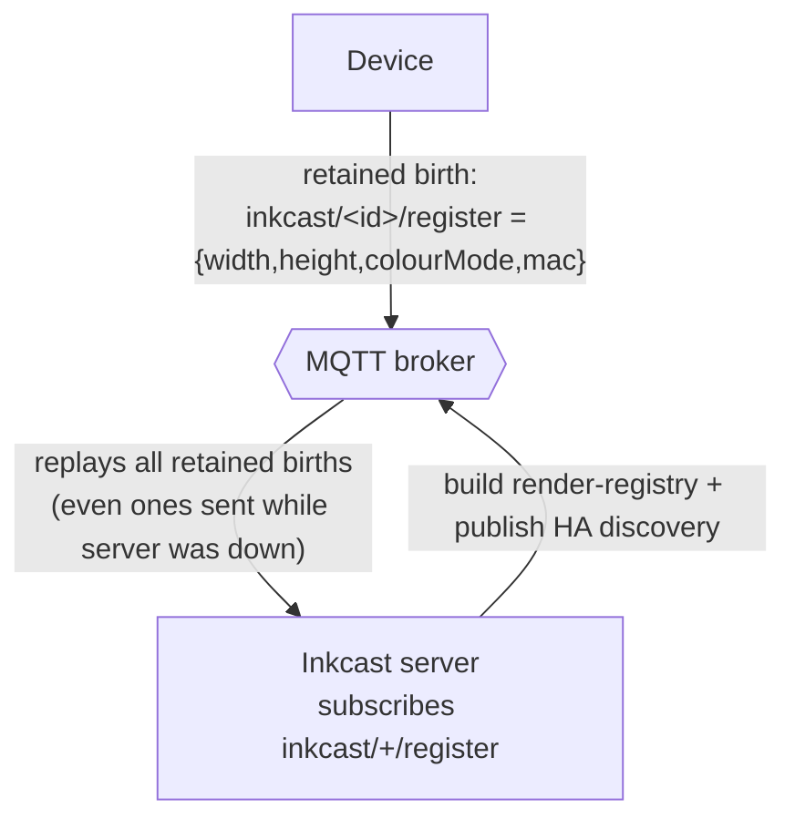

# Inkcast architecture (data flow)

Everything is **MQTT pub/sub through one broker** — no actor opens a direct connection to
another. Three roles:

- **Home Assistant** — the brain. Pushes each screen's view data, drives the View
  select / Refresh / config knobs, and auto-creates the entities it's told about.
- **Inkcast server (container)** — renders pixels and **owns the device list**
  (each device's geometry + colour mode). At boot it publishes the retained HA
  MQTT-discovery configs; that publish is what makes the entities appear in HA.
- **Device (Pi receiver)** — a dumb sink: subscribes to one image topic, decodes the
  PNG, draws it.

## Two things MQTT gives us that make this work

- **Retained messages.** The broker keeps the last message on a topic and replays it to
  any new subscriber. That's why a rebooted Pi instantly redraws (the PNG on
  `inkcast/<id>/image` is retained), and why *stale* retained configs show up as ghost HA
  entities until explicitly cleared with an empty retained payload.
- **Wildcards (subscribe side).** `+` matches one topic level, `#` matches the rest — so a
  process can watch `inkcast/+/image` or `inkcast/<id>/#` without knowing every topic
  ahead of time.

## Alternative considered: device self-registration (not adopted)

Instead of Inkcast holding the device list, each device could **announce itself** with a
retained "birth" message carrying its geometry, and Inkcast would discover the fleet by
subscribing with a wildcard:

This answers "how would Inkcast know to look for them?" — a device's retained `register`
message persists on the broker, so a server that (re)connects later still receives every
device's registration the moment it subscribes to `inkcast/+/register`.

| | Central config (today) | Device self-registration |
| --- | --- | --- |
| Device firmware | truly dumb (one image topic) | must publish its own geometry (heavier) |
| Add/remove a screen | edit config file + restart | plug in / clear its retained `register` |
| Source of truth for geometry | one reviewable file | the device itself |
| Rogue/duplicate devices | impossible (server-owned) | must validate incoming registrations |
| Dead-device cleanup | delete a config line | clear a retained topic (same ghost risk) |
| ESPHome dumb-fetcher fit | good | poor (can't self-register richly) |

**Verdict:** for a small, stable home fleet and the dumb-sink/ESPHome direction, central
config is simpler and keeps the device dumb. Self-registration is the idiomatic MQTT answer
for large or plug-and-play fleets. Kept central config; revisit if the fleet grows.
